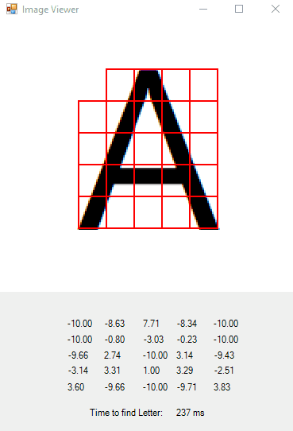
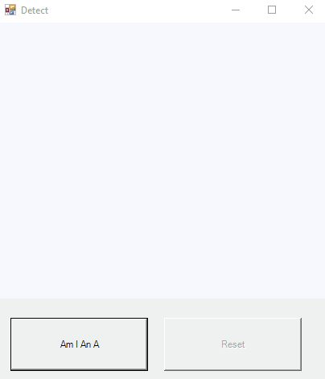

# Am I an A?

### What?
This program does a pretty simply thing.  It lets you draw a picture and then tell you if the image contains a capital A. 

#### Training

#### Detect

### Why?
I found [this](https://visualstudiomagazine.com/articles/2013/08/01/neural-network-back-propagation-using-c.aspx) great article by [James McCaffrey](https://www.microsoft.com/en-us/research/people/jammc/) and wanted to build something to get a better understanding of [ANNs](https://en.wikipedia.org/wiki/Artificial_neural_network).  I liked that it was entirely self-contained.  The small surface area and easy to follow (if not exactly performant) code makes it easy to see how these things work under the hood.  As such, currently, the ANN implementation is almost a wholesale ctrl-c ctrl-v job (with some minor changes to deal with a different serialized input vector format).  I'm using his implementation along with a few other resources to gain a better understanding of the why's and how's.  

I wanted to keep things relatively simple so I made the classification binary. 

### How does it work?
The program uses back-propagation to train a ANN with 25 inputs nodes, 18 hidden nodes, and 2 output nodes.  If the image does contain an A the output will be (1,0) otherwise (0,1).  The node counts for each layer is arbitary.  

The most original part of the program is training vectors creation.  The program runs through a list of image-answer pairs.  To make the training vector, the program breaks up the image into 25 squares.  Each square is assigned a value in the range [-10, +10] depending on how much black it contains.  For example, if the box is completely white the value will be -10. If it's completely black then 10.  If fifty-fifty then 0.  Starting at the top left and working towards the bottom right the squares are flattened into a one dimensional array.  The input array is then appended to either (1, 0) if it was an A or (0, 1) if it wasn't an A.  The result is a 27 element float vector.  All training vectors are fed into the ANN via a train procedure that does the work of resolving the weight (__W__) and bias (__b__) vectors.

When a user draws a sample, the same code used to create the training set is ran on the input.  The vector is created and feed into a compute procedure.  The computer procedure uses the __W__ and __b__ vectors created during training to give a result.  

Note: This uses WinForms so get your Windows machines ready!

### Building 

Did this with Visual Studio 2017 Community Edition

Cool, works with Visual Studio 2022 CE too.

